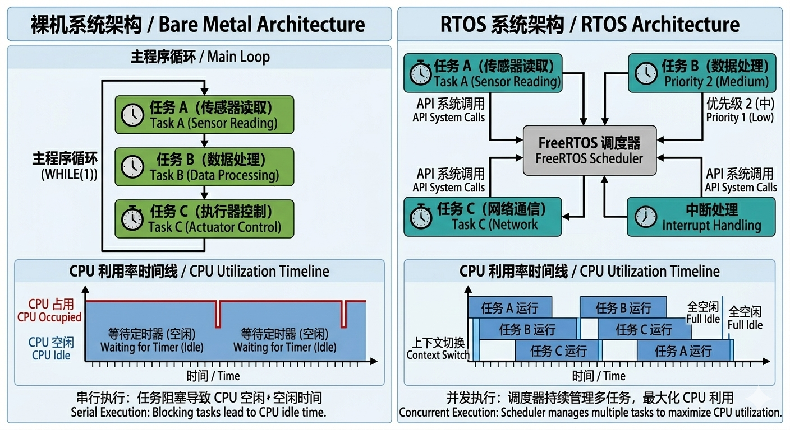
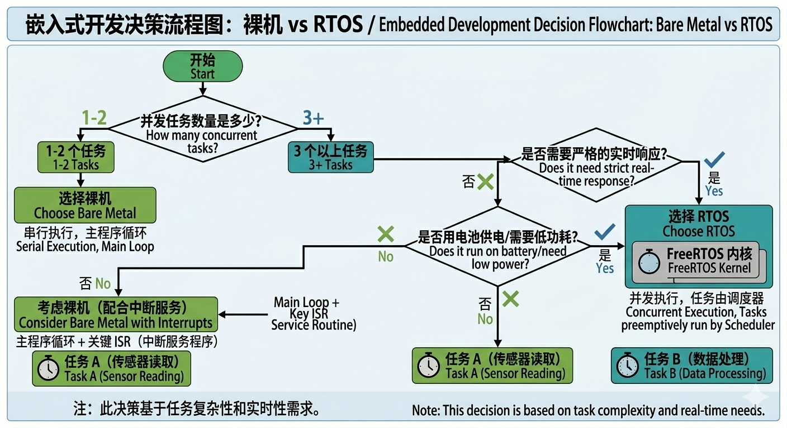

# 0.2 裸机与多线程的对比

## 两种编程范式



---

## 裸机（Bare Metal / Super Loop）

### 典型结构

```c
int main(void) {
    hardware_init();

    while (1) {
        task_1();   // 假设需要 5ms
        task_2();   // 假设需要 3ms
        task_3();   // 假设需要 10ms
        // 总周期：18ms
        // 如果某个任务变慢，整体周期拉长
    }
}
```

### 中断 + 标志位模式

```c
volatile uint8_t flag_data_ready = 0;

void UART_IRQHandler(void) {
    if (UART->ISR & RXNE) {
        buffer[buf_idx++] = UART->RDR;
        if (buf_idx >= BUF_SIZE) {
            flag_data_ready = 1;
            buf_idx = 0;
        }
    }
}

int main(void) {
    while (1) {
        if (flag_data_ready) {
            process_data(buffer);
            flag_data_ready = 0;
        }
        // 其他任务...
    }
}
```

---

## 多线程（RTOS）

### 典型结构

```c
int main(void) {
    hardware_init();

    // 创建 3 个任务，优先级不同
    xTaskCreate(task_1, "Task1", 256, NULL, 2, NULL);
    xTaskCreate(task_2, "Task2", 256, NULL, 1, NULL);
    xTaskCreate(task_3, "Task3", 256, NULL, 1, NULL);

    vTaskStartScheduler();  // 启动调度器
}

void task_1(void *param) {
    while (1) {
        do_work_1();
        vTaskDelay(pdMS_TO_TICKS(5));  // 阻塞 5ms，不占用 CPU
    }
}
```

---

## 核心对比

| 维度 | 裸机 | RTOS |
|------|------|------|
| **并发** | 假并发（分时复用） | 真并发（多任务独立） |
| **响应** | 中断触发，但主循环可能阻塞 | 高优先级任务可立即抢占 |
| **CPU 利用率** | 低（空转等待） | 高（阻塞时不占用 CPU） |
| **功耗** | 高（循环空转） | 低（任务阻塞时 CPU 休眠） |
| **扩展性** | 差（改一个动全身） | 好（新增任务即可） |
| **RAM 占用** | 几乎 0 | 每个任务需要独立栈 |
| **调试** | 相对简单 | 复杂（并发问题） |
| **确定性** | 中等 | 高（调度策略固定） |

---

## 实战选择



### 选裸机的场景

- 简单顺序执行，无并发需求
- 资源极其紧张（RAM < 4KB）
- 产品已稳定，不需要扩展
- 极端低功耗（深度休眠 + RTC 唤醒）

### 选 RTOS 的场景

- 3 个以上独立任务
- 需要快速响应外部事件
- 任务之间有依赖关系（需要同步/通信）
- 产品周期长，需要后续扩展
- 网络协议栈、文件系统等复杂中间件

---

## 本节小结

- 裸机 = 简单、可控、资源占用低
- RTOS = 并发、实时、可扩展、功耗低
- 没有绝对的好坏，只有场景的匹配
- 工作中常见误区：无论什么都上 RTOS（杀鸡焉用牛刀）或死守裸机（明明该上系统偏不上）

---

## 思考题

1. 如果一个任务每 100ms 执行一次，另两个任务分别每 1s 和每 10s 执行，用裸机怎么写？用 RTOS 呢？
2. 某工控场景要求按键响应 < 5ms，但主循环当前要 20ms，怎么改进？
