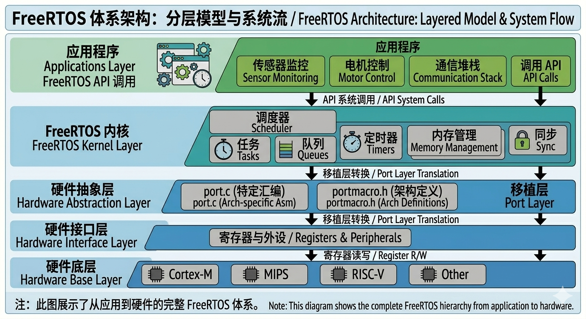
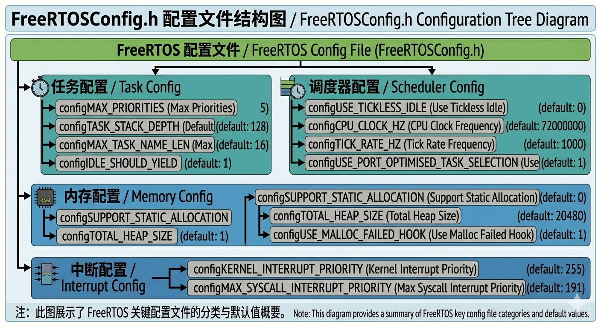
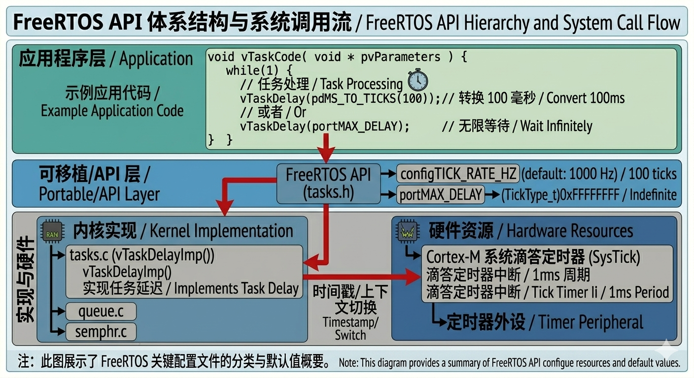
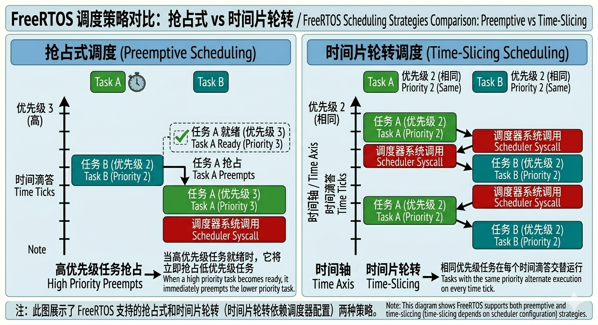

# 0.3 FreeRTOS 架构总览

## FreeRTOS 整体架构



---

## 源码目录结构

```
FreeRTOS/
├── FreeRTOS/                    # 内核源码
│   ├── Include/                 # 头文件（公开 API）
│   │   ├── freertos/*.h        # 任务、队列、信号量等
│   │   └── projdefs.h          # 项目相关定义
│   ├── Source/
│   │   ├── tasks.c             # 任务管理（最大，约40%）
│   │   ├── queue.c             # 队列（约20%）
│   │   ├── list.c              # 链表（调度器用）
│   │   ├── timers.c            # 软件定时器
│   │   ├── event_groups.c      # 事件组
│   │   └── croutine.c          # 协程（已废弃）
│   └── portable/               # 移植层
│       ├── MemMang/            # 内存管理（5种heap实现）
│       └── ARM_CM*/            # Cortex-M 各型号移植
│
├── Demo/                        # 示例工程
└── License/                     # MIT 许可证
```

---

## 内核核心模块

| 模块 | 源文件 | 作用 |
|------|--------|------|
| **Tasks** | tasks.c | 任务创建、删除、调度 |
| **Scheduler** | tasks.c | 调度器（核心） |
| **Queue** | queue.c | 任务间通信/同步 |
| **List** | list.c | 链表（调度器数据结构） |
| **Timer** | timers.c | 软件定时器 daemon |
| **Event Groups** | event_groups.c | 事件标志组 |
| **Memory** | heap_1~5.c | 动态内存分配 |
| **Port** | port.c | 硬件相关（上下文切换） |

---

## 核心配置项（FreeRTOSConfig.h）

FreeRTOS 通过配置开关实现高度可裁剪：

```c
// 任务相关
#define configMAX_PRIORITIES         (5)      // 最大优先级数
#define configMINIMAL_STACK_SIZE     (128)    // 最小栈大小（word）
#define configSUPPORT_DYNAMIC_ALLOCATION  1   // 支持动态内存

// 调度器相关
#define configUSE_PREEMPTION         1        // 1=抢占式 0=协作式
#define configUSE_TIME_SLICING       1        // 时间片轮转
#define configCPU_CLOCK_HZ           (72000000)
#define configTICK_RATE_HZ           (1000)   // Tick 频率 1ms

// 系统相关
#define configTOTAL_HEAP_SIZE        ((size_t)10240)  // heap 大小
#define configUSE_MUTEXES            1        // 互斥量
#define configUSE_COUNTING_SEMAPHORES 1       // 计数信号量
#define configUSE_RECURSIVE_MUTEXES  1        // 递归互斥量
```



---

## API 分层



### 核心 API 速查

| 类别 | 函数 | 说明 |
|------|------|------|
| **任务** | `xTaskCreate()` | 动态创建任务 |
| | `vTaskDelete()` | 删除任务 |
| | `vTaskDelay()` | 相对延时 |
| | `vTaskDelayUntil()` | 绝对延时 |
| | `vTaskSuspend()` | 挂起任务 |
| **队列** | `xQueueCreate()` | 创建队列 |
| | `xQueueSend()` | 发送（尾部） |
| | `xQueueReceive()` | 接收 |
| **信号量** | `xSemaphoreCreateMutex()` | 互斥量 |
| | `xSemaphoreTake()` | 获取 |
| | `xSemaphoreGive()` | 释放 |
| **内存** | `pvPortMalloc()` | 分配 |
| | `vPortFree()` | 释放 |

---

## 调度策略

FreeRTOS 支持三种调度策略：

### 1. 抢占式调度（Preemption）
- 高优先级任务就绪，立即抢占低优先级
- **最常用**
- `configUSE_PREEMPTION = 1`

### 2. 协作式调度（Cooperative）
- 任务主动让出 CPU 才切换
- `configUSE_PREEMPTION = 0`

### 3. 时间片轮转（Time Slicing）
- 同优先级任务轮流执行
- 时间片 = 1 个 Tick
- `configUSE_TIME_SLICING = 1`



---

## 本节小结

- FreeRTOS 内核小巧（约 9000 行），高度可配置
- 源码分内核层 + 移植层，移植只需改 port.c / portmacro.h
- 所有功能通过 `FreeRTOSConfig.h` 裁剪，不需要改动内核源码
- 调度策略：抢占式最常用，时间片辅助同优先级轮转
